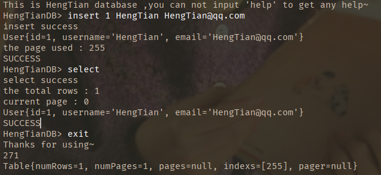
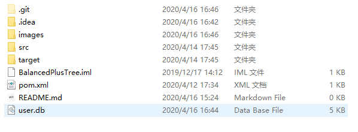
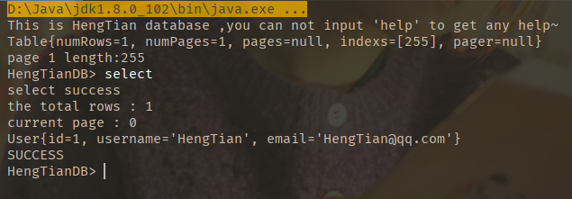
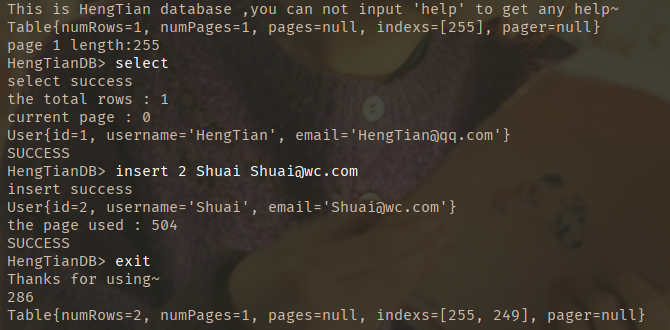
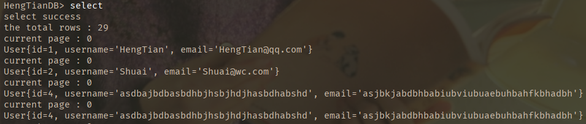
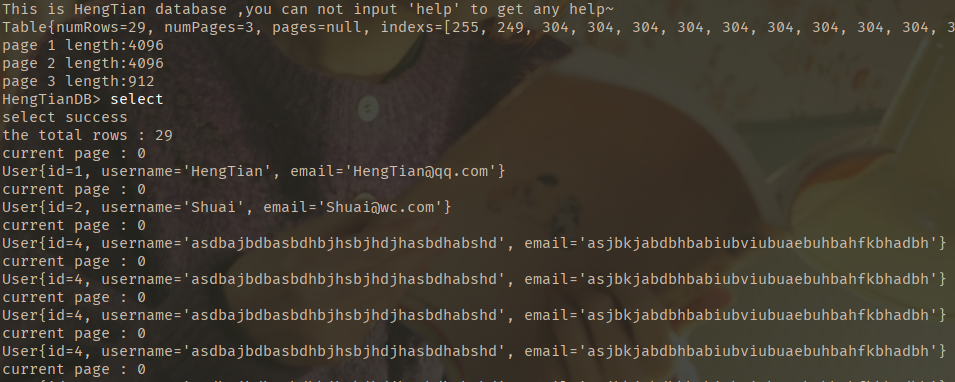

## 用Java实现的小型数据库

### 目前效果

前提：

1. 固定表结构的存储
   
2. 目前只能进行insert和select操作
3. 顺序存储
4. 数据页每页大小4kb

目前效果图：

exit后数据以字节码存储到user.db中

第二次运行结果

批量插入数据使数据量达到两个page以上

再次exit重新启动，稳定

### 数据结构

### 拓展
添加一个LRU List来插入修改后的页
添加另一个Flush List来存储LRU List中置换出来的页然后写入到磁盘中

每次读16K到列表中（4页）